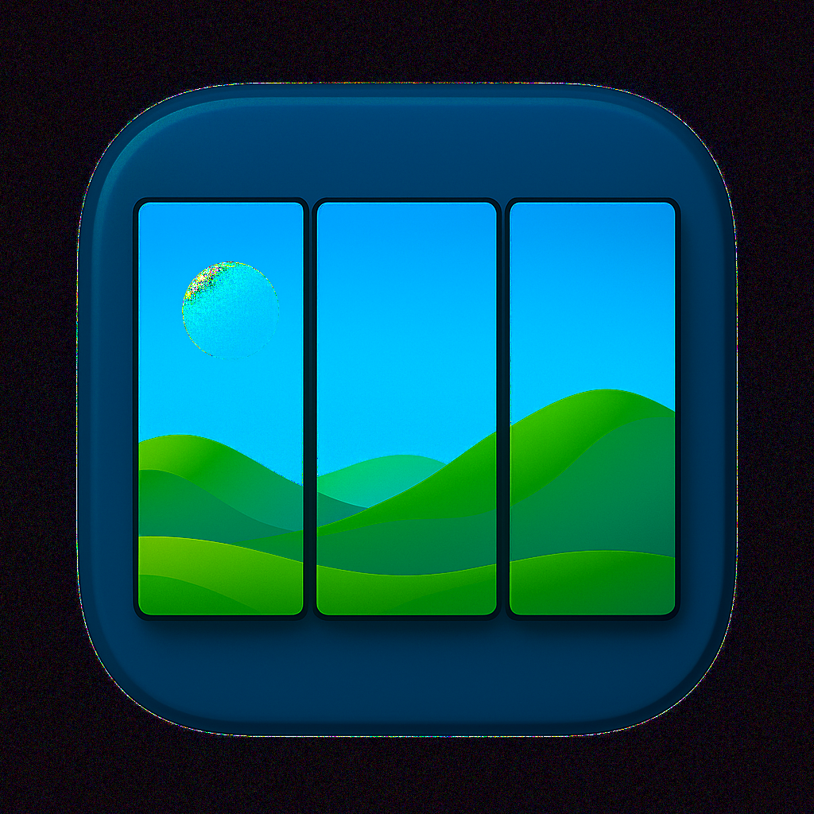

# Wallpaper Splitter

A C++ application for splitting wallpapers across multiple monitors with native desktop environment support. Currently supports KDE Plasma with a modular architecture designed for easy extension to other desktop environments.



## Features

- **Multi-Monitor Support**: Automatically detects connected monitors and their layouts using Qt's cross-platform screen detection
- **Smart Image Splitting**: Splits images based on monitor geometry and positioning using Qt's built-in image processing
- **Native Desktop Integration**: Uses native wallpaper application methods for each desktop environment
- **Modular Architecture**: Core functionality separated from UI for easy extension
- **KDE Plasma Interface**: Native Qt/KDE GUI with modern design
- **Command Line Interface**: Full CLI support for automation and scripting
- **Flatpak Support**: Available as a Flatpak package for easy installation
- **Cross-Platform**: Works on both X11 and Wayland display servers
- **Alternating Prefix System**: Forces desktop environments to detect wallpaper changes

## Architecture

The project follows a modular architecture with clear separation of concerns:

```
wallpaper-splitter/
├── include/core/           # Core library headers
│   ├── monitor_info.h      # Monitor data structures
│   ├── monitor_detector.h  # Monitor detection interface
│   ├── image_splitter.h    # Image splitting interface
│   └── wallpaper_applier.h # Wallpaper application interface
├── src/
│   ├── core/               # Core library implementation
│   │   ├── monitor_detector.cpp    # Qt-based monitor detection
│   │   ├── image_splitter.cpp      # Qt-based image splitting
│   │   └── wallpaper_applier.cpp   # KDE Plasma wallpaper application
│   ├── kde/                # KDE Plasma GUI
│   │   ├── main.cpp        # Application entry point
│   │   ├── mainwindow.cpp  # Main window implementation
│   │   ├── monitorwidget.cpp # Individual monitor display
│   │   └── imagepreview.cpp # Image preview widget
│   └── cli/                # Command line interface
│       └── main.cpp        # CLI implementation
├── org.wallpapersplitter.app.yml    # Flatpak manifest
├── org.wallpapersplitter.app.desktop # Desktop integration
├── org.wallpapersplitter.app.metainfo.xml # App metadata
└── original-icon-file-transparent-512.png # Application icon
```

### Core Components

1. **MonitorDetector**: Detects connected monitors using Qt's QScreen API (works on X11 and Wayland)
2. **ImageSplitter**: Splits images using Qt's QImage for cropping and resizing
3. **WallpaperApplier**: Applies wallpapers using KDE Plasma's DBus interface with JavaScript scripting

### Interface Layer

- **KDE Plasma GUI**: Native Qt/KDE interface with monitor preview and image selection
- **Command Line Interface**: Full-featured CLI for automation
- **Future**: GNOME, XFCE, and other desktop interfaces can be easily added

## Installation

### Flatpak (Recommended)

The easiest way to install Wallpaper Splitter is via Flatpak:

```bash
# Build and install locally
flatpak-builder --user --install --force-clean build-dir org.wallpapersplitter.app.yml

# Run the application
flatpak run org.wallpapersplitter.app
```

### Manual Build

#### Dependencies

##### Required
- **Qt6**: Core Qt libraries (Core, Widgets, Gui)
- **KF6**: KDE Frameworks (CoreAddons, WidgetsAddons, I18n)
- **CMake**: Build system

##### Installation on Manjaro/Arch
```bash
sudo pacman -S qt6-base qt6-tools kf6-kcoreaddons kf6-kwidgetsaddons kf6-ki18n cmake
```

##### Installation on Ubuntu/Debian
```bash
sudo apt install qt6-base-dev qt6-tools-dev libkf6coreaddons-dev libkf6widgetsaddons-dev libkf6i18n-dev cmake
```

#### Building

1. **Clone the repository**:
   ```bash
   git clone https://github.com/yourusername/wallpaper-splitter.git
   cd wallpaper-splitter
   ```

2. **Create build directory**:
   ```bash
   mkdir build && cd build
   ```

3. **Configure and build**:
   ```bash
   cmake ..
   make -j$(nproc)
   ```

4. **Install** (optional):
   ```bash
   sudo make install
   ```

## Usage

### Graphical Interface (KDE Plasma)

1. Launch the application:
   ```bash
   # If built manually
   ./wallpaper-splitter-kde
   
   # If installed via Flatpak
   flatpak run org.wallpapersplitter.app
   ```

2. Click "Select Image" to choose your wallpaper image
3. Review detected monitors in the list
4. Click "Apply Wallpapers" to split and apply the wallpaper

### Command Line Interface

**List detected monitors**:
```bash
# If built manually
./wallpaper-splitter-cli -l

# If installed via Flatpak
flatpak run --command=wallpaper-splitter-cli org.wallpapersplitter.app -l
```

**Split image without applying**:
```bash
./wallpaper-splitter-cli -i /path/to/image.jpg -o /output/directory
```

**Split and apply wallpapers**:
```bash
./wallpaper-splitter-cli -i /path/to/image.jpg -a
```

**Full options**:
```bash
./wallpaper-splitter-cli -i /path/to/image.jpg -o /output/directory -a
```

## How It Works

### Monitor Detection
Uses Qt's QScreen API to detect connected monitors, their resolutions, and positions. This works on both X11 and Wayland display servers.

### Image Splitting
The application splits images using a simple horizontal division approach:
- For 3 monitors: Each monitor gets 1/3 of the image width
- Images are cropped and resized to match each monitor's resolution
- Uses Qt's QImage for all image processing operations

### Wallpaper Application
Uses KDE Plasma's DBus interface with JavaScript scripting to:
- Set different wallpapers for each monitor
- Force Plasma to refresh and detect changes
- Uses alternating filename prefixes (a_ and b_) to ensure Plasma detects file changes

### Alternating Prefix System
To ensure KDE Plasma detects wallpaper changes, the application uses alternating filename prefixes:
- First run: `a_wallpaper_0.jpg`, `a_wallpaper_1.jpg`, etc.
- Second run: `b_wallpaper_0.jpg`, `b_wallpaper_1.jpg`, etc.
- This forces Plasma to reload the wallpaper configuration

## Technical Details

### Image Processing
- **Library**: Qt's QImage (no external dependencies)
- **Format**: JPEG with 95% quality
- **Processing**: Cropping, resizing, and format conversion
- **Output**: Individual files for each monitor

### Monitor Layout
- Monitors are sorted by X position (left to right)
- Each monitor gets a corresponding section of the input image
- Supports arbitrary monitor resolutions and arrangements

### DBus Integration
- Uses `qdbus` to communicate with KDE Plasma
- JavaScript scripting for wallpaper configuration
- Automatic refresh triggers to update the desktop

## Extending for Other Desktop Environments

To add support for other desktop environments (e.g., GNOME, XFCE):

1. **Create a new wallpaper applier**:
   - Inherit from `WallpaperApplier`
   - Implement desktop-specific wallpaper application logic
   - Add detection for the desktop environment

2. **Create a new GUI interface**:
   - Create a new directory under `src/` (e.g., `src/gnome/`)
   - Implement native UI components for that desktop
   - Use the same core library components

3. **Update CMakeLists.txt**:
   - Add new targets for the interface
   - Include appropriate dependencies

## Flatpak Details

The Flatpak package includes:
- **Runtime**: KDE Platform 6.6
- **Permissions**: Session DBus, filesystem access, network
- **Icon**: Custom application icon
- **Desktop Integration**: Proper desktop file and metadata

### Flatpak Permissions
- `--socket=session-bus`: Access to user's DBus session
- `--socket=wayland` and `--socket=x11`: Display server access
- `--filesystem=home`: Access to user's home directory
- `--talk-name=org.freedesktop.DBus`: DBus communication

## Troubleshooting

### Common Issues

**No monitors detected**:
- Ensure you're running on a supported display server (X11 or Wayland)
- Check that Qt can access screen information
- Verify monitor connections

**Image splitting fails**:
- Ensure the input image is readable
- Check that the image is large enough for your monitor setup
- Verify write permissions in the output directory

**Wallpapers don't change**:
- Ensure you're running KDE Plasma
- Check that DBus is accessible (especially in Flatpak)
- Try running the application multiple times to trigger the alternating prefix system

**Flatpak issues**:
- Ensure Flatpak is properly installed
- Check that the KDE Platform runtime is installed
- Verify that the application has the necessary permissions

### Debug Information
The application provides detailed debug output including:
- Monitor detection results
- Image processing steps
- DBus script execution
- File creation and modification times

## Contributing

1. Fork the repository
2. Create a feature branch
3. Make your changes
4. Add tests if applicable
5. Submit a pull request

## License

This project is licensed under the GPL v3 License - see the LICENSE file for details.

## Acknowledgments

- Built with Qt6 and KDE Frameworks 6
- Uses Qt's cross-platform screen detection
- Implements KDE Plasma's DBus wallpaper interface
- Packaged as Flatpak for easy distribution 